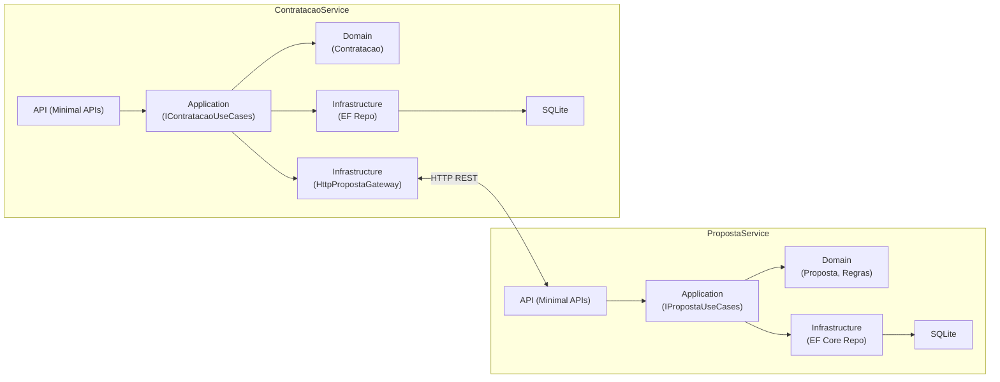

# FluxoSeguro — Propostas & Contratações (Hexagonal, .NET 9)

Blueprint de plataforma de seguros com **Arquitetura Hexagonal (Ports & Adapters)**, **DDD**, **.NET 9**, **EF Core + SQLite**, **Swagger** e **testes (unit + integração)**.

- **PropostaService** — cria, lista e altera status de propostas.
- **ContratacaoService** — contrata **apenas** se a proposta estiver **Aprovada**, consultando o PropostaService via HTTP.

---

## Quickstart

### Pré-requisitos

- Docker Desktop (Linux containers)
- (Opcional) .NET SDK 9.0+ se quiser rodar sem Docker

### 1) Subir com Docker Compose (recomendado)

Na **raiz** do repositório:

```bash
docker compose up --build -d
docker compose ps
````

Acesse:

* Propostas → [http://localhost:5024/swagger](http://localhost:5024/swagger)
* Contratações → [http://localhost:5034/swagger](http://localhost:5034/swagger)

### 2) Smoke test (curl)

```bash
# 1) Criar proposta
CREATE=$(curl -s -X POST http://localhost:5024/propostas \
  -H "Content-Type: application/json" \
  -d '{ "nomeCliente": "Alice", "valor": 1500 }')
ID=$(echo "$CREATE" | jq -r '.id')

# 2) Aprovar (0=EmAnalise, 1=Aprovada, 2=Rejeitada)
curl -i -X PUT "http://localhost:5024/propostas/$ID/status" \
  -H "Content-Type: application/json" \
  -d '{ "status": 1 }'

# 3) Contratar
curl -s -X POST http://localhost:5034/contratacoes \
  -H "Content-Type: application/json" \
  -d "{ \"propostaId\": \"$ID\" }"
```

Resultado esperado: **201** com `{ "id": "<guid>" }` no passo 3.

---

## Arquitetura (visão)



---

## Estrutura de pastas

```

/                  # raiz do monorepo
├─ docker-compose.yml
├─ README.md
├─ doc/            # documentação detalhada (design/ADRs/how-to)
├─ src/
│  ├─ PropostaService/           # Domain / Application / Infrastructure / Api
│  │  ├─ data/                   # SQLite (dev)
│  │  └─ Dockerfile
│  └─ ContratacaoService/
│     ├─ data/
│     └─ Dockerfile
└─ tests/
   ├─ PropostaService.Tests/
   └─ ContratacaoService.Tests/

```

---

## Referência rápida das APIs

### PropostaService

* **POST** `/propostas` → `201 { "id": "<guid>" }`

  Body: `{ "nomeCliente": "Alice", "valor": 1200.0 }`

* **GET** `/propostas` → `200 { "items": [...], "count": N }`

* **PUT** `/propostas/{id}/status` → `204`

  Body: `{ "status": 1 }` (`0=EmAnalise`, `1=Aprovada`, `2=Rejeitada`)

### ContratacaoService

**POST** `/contratacoes` → `201 { "id": "<guid>" }`

  Body: `{ "propostaId": "<guid>" }`
  Erros: `400` (não aprovada), `404` (inexistente)

**GET** `/contratacoes` → `200 { "items": [...], "count": N }`

> Obs.: `DataContratacao` no ContratacaoService é mapeado como **UnixTime (INTEGER)** no SQLite para suportar `ORDER BY` sem erros.

---

## Rodar sem Docker (opcional)

### PropostaService

```bash
cd src/PropostaService
dotnet ef database update
dotnet run --launch-profile http    # http://localhost:5024
```

### ContratacaoService

```bash
cd src/ContratacaoService
# se necessário, aponte para o PropostaService local:
# export PropostaService__BaseUrl="http://localhost:5024"    (bash)
# setx PropostaService__BaseUrl "http://localhost:5024"      (PowerShell/Windows, novo terminal)
dotnet ef database update
dotnet run --launch-profile http    # http://localhost:5034
```

---

## Testes automatizados

```bash
dotnet test
```

* Cobertura via `coverlet.collector`.
* Testes de integração usam `WebApplicationFactory`, SQLite in-memory e **FakePropostaGateway** no ContratacaoService.

---

## Variáveis de ambiente

| Serviço            | Variável                   | Default                | Uso                          |
| ------------------ | -------------------------- | ---------------------- | ---------------------------- |
| ContratacaoService | `PropostaService__BaseUrl` | `http://proposta:8080` | Base do HttpClient (compose) |
| Ambos              | `ASPNETCORE_ENVIRONMENT`   | `Development`          | Habilita Swagger, etc.       |
| Ambos (container)  | `ASPNETCORE_URLS`          | `http://+:8080`        | Bind Kestrel                 |

---

## Troubleshooting

* **Containers sobem e caem com `SQLite Error 14: 'unable to open database file'`**
  É permissão de escrita no volume. No `docker-compose.yml` deixamos:

  ```yaml
  user: "0:0"
  ```

  Alternativa: bind-mount para pastas do host onde você tenha escrita:

  ```yaml
  volumes:
    - ./data/proposta:/app/data
    - ./data/contratacao:/app/data
  ```

* **`docker compose ps` mostra containers, mas `docker ps` não**
  Verifique o contexto:

  ```bash
  docker context ls
  docker context use desktop-linux
  docker ps
  ```

* **Porta em uso**
  Ajuste as portas no compose (`5024`/`5034`) para outras livres.

* **Swagger não abre no VS**
  Use o profile **http/https** do **Project** (não o Docker), e verifique `launchSettings.json` com `launchUrl: "swagger"`.

---

## Documentação adicional

Conteúdo detalhado de arquitetura e decisões está em [`/doc`](./doc).

---
