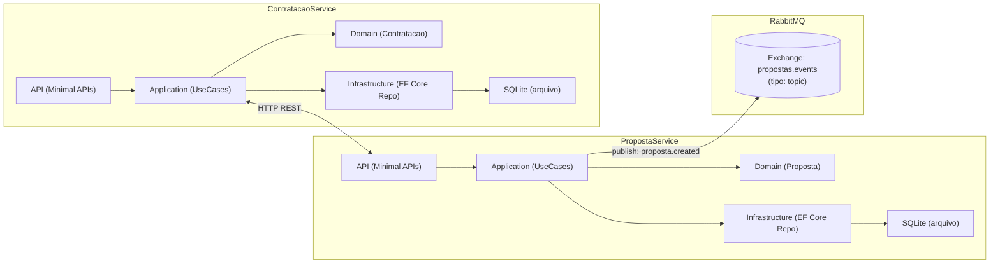
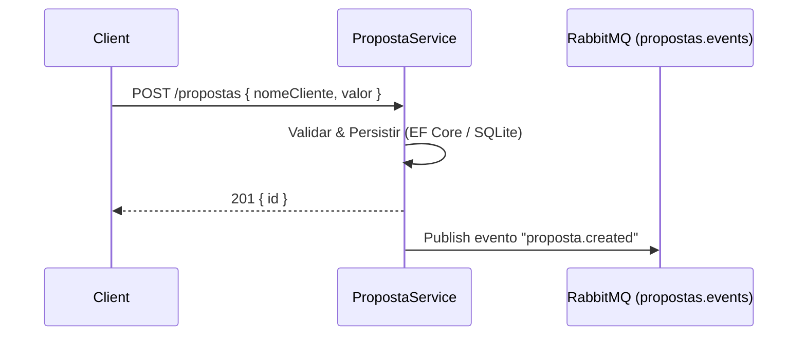

# FluxoSeguro — Propostas & Contratações (Hexagonal, .NET 9)

Blueprint de plataforma de seguros com **Arquitetura Hexagonal (Ports & Adapters)**, **DDD**, **.NET 9**, **EF Core + SQLite**, **Swagger**, **Testes (xUnit + WebApplicationFactory)** e **Mensageria (RabbitMQ)**.

- **PropostaService** — cria, lista e altera status de propostas. No *happy path* do `POST /propostas`, publica o evento **`proposta.created`** no exchange **`propostas.events`**.
- **ContratacaoService** — contrata **somente** se a proposta estiver **Aprovada**, consultando o PropostaService via HTTP.

---

## Quickstart (Docker Compose)

```bash
docker compose up --build -d
docker compose ps
````

Acesse:

* Propostas → [http://localhost:5024/swagger](http://localhost:5024/swagger)
* Contratações → [http://localhost:5034/swagger](http://localhost:5034/swagger)
* RabbitMQ UI → [http://localhost:15672](http://localhost:15672) (guest/guest)

> **Observação (SQLite em container):** usamos `user: "0:0"` e volumes nomeados para garantir permissão de escrita em `/app/data`.

---

## Diagrama de Alto Nível



### Sequência (criação de proposta)



---

## Endpoints

### PropostaService

* **POST** `/propostas` → `201 { "id": "<guid>" }`
  Body: `{ "nomeCliente": "Alice", "valor": 1500.0 }`
* **GET** `/propostas` → `200 { "items": [...], "count": N }`
* **PUT** `/propostas/{id}/status` → `204`
  Body: `{ "status": 1 }` (`0=EmAnalise`, `1=Aprovada`, `2=Rejeitada`)

### ContratacaoService

* **POST** `/contratacoes` → `201 { "id": "<guid>" }`
  Body: `{ "propostaId": "<guid>" }`
  Erros: `400` (não aprovada), `404` (inexistente)
* **GET** `/contratacoes` → `200 { "items": [...], "count": N }`

---

## Variáveis de Ambiente (principais)

| Serviço            | Variável                   | Default                | Uso                           |
| ------------------ | -------------------------- | ---------------------- | ----------------------------- |
| ContratacaoService | `PropostaService__BaseUrl` | `http://proposta:8080` | Base do HttpClient (compose)  |
| Ambos              | `ASPNETCORE_ENVIRONMENT`   | `Development`          | Habilita Swagger, etc.        |
| Ambos              | `ASPNETCORE_URLS`          | `http://+:8080`        | Bind Kestrel                  |
| PropostaService    | `RabbitMQ__HostName`       | `rabbitmq`             | Host do broker                |
| PropostaService    | `RabbitMQ__Port`           | `5672`                 | Porta AMQP                    |
| PropostaService    | `RabbitMQ__UserName`       | `guest`                | Credenciais                   |
| PropostaService    | `RabbitMQ__Password`       | `guest`                | Credenciais                   |
| PropostaService    | `RabbitMQ__VirtualHost`    | `/`                    | VHost                         |
| PropostaService    | `RabbitMQ__Exchange`       | `propostas.events`     | Exchange do domínio Propostas |
| PropostaService    | `RabbitMQ__ExchangeType`   | `topic`                | Tipo do exchange              |

---

## Smoke Test (curl)

```bash
# 1) Criar proposta
CREATE=$(curl -s -X POST http://localhost:5024/propostas \
  -H "Content-Type: application/json" \
  -d '{ "nomeCliente": "Alice", "valor": 1500 }')
ID=$(echo "$CREATE" | jq -r '.id')

# 2) Aprovar (0=EmAnalise, 1=Aprovada, 2=Rejeitada)
curl -i -X PUT "http://localhost:5024/propostas/$ID/status" \
  -H "Content-Type: application/json" \
  -d '{ "status": 1 }'

# 3) Contratar
curl -s -X POST http://localhost:5034/contratacoes \
  -H "Content-Type: application/json" \
  -d "{ \"propostaId\": \"$ID\" }"
```

### Ver evento no RabbitMQ

Abra [http://localhost:15672](http://localhost:15672) (guest/guest) → **Queues** → adicione fila `propostas.created.debug` (Durable).
Em **Exchanges** → `propostas.events` → crie **binding** com routing key `proposta.created` → *Bind*.
Na fila → **Get messages** → deve aparecer o JSON publicado no passo 1.

---

## Documentação adicional

Ver [`/doc`](./doc) para detalhes de mensageria, decisão arquitetural e fluxos.

---


