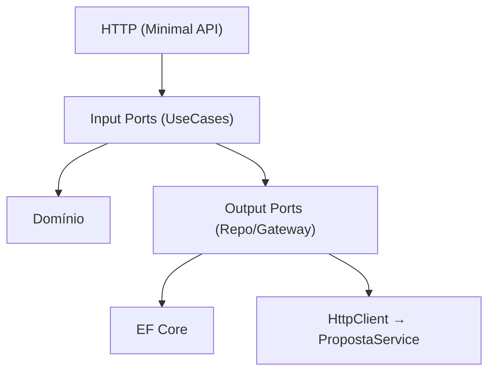

# FluxoSeguro — Design & Operating Model (doc)

> Este documento aprofunda a **arquitetura**, **contratos**, **decisões** e **boas práticas** usadas no monorepo.

## Índice

- [Arquitetura Hexagonal](#arquitetura-hexagonal)
- [Camadas e Responsabilidades](#camadas-e-responsabilidades)
- [Contratos & DTOs](#contratos--dtos)
- [Persistência & Migrations](#persistência--migrations)
- [Integração entre Serviços](#integração-entre-serviços)
- [Test Strategy](#test-strategy)
- [Observabilidade & Swagger](#observabilidade--swagger)
- [Segurança (placeholder)](#segurança-placeholder)
- [Roadmap / Próximos Passos](#roadmap--próximos-passos)
- [ADRs](#adrs)

## Arquitetura Hexagonal

- **Input Ports**: Interfaces de caso de uso consumidas por drivers (HTTP, workers).  
  - `IPropostaUseCases`, `IContratacaoUseCases`
- **Output Ports**: Dependências para fora do core (DB/HTTP/filas).  
  - `IPropostaRepository`, `IContratacaoRepository`, `IPropostaGateway`
- **Adapters**:
  - **Driving (entrada)**: Minimal APIs (Swagger/OpenAPI), validador de payload.
  - **Driven (saída)**: EF Core Repositories; `HttpPropostaGateway`.

### Diagrama de alto nível

## Camadas e Responsabilidades

**Domain**

* Entidades ricas com invariantes:

  * `Proposta` (status: EmAnalise/Aprovada/Rejeitada)
  * `Contratacao` (PropostaId, DataContratacao)
* Sem dependência de framework.

**Application**

* **Use Cases** orquestram regras de negócio.
* Validam inputs e chamam **Output Ports**.
* Ex.: `ContratarAsync(propostaId)` → consulta status via `IPropostaGateway` → persiste.

**Infrastructure**

* **EF Core** (`DbContext`, `Repository`) e mapeamentos.
* **HttpPropostaGateway** com `HttpClient`/`BaseAddress` configurável.

**API (Minimal)**

* Endpoints finos.
* Retornos camelCase (`{ id }`, `{ items, count }`).

## Contratos & DTOs

**PropostaService**

* `POST /propostas` → `{ "id": "<guid>" }`
* `GET /propostas` → `{ "items": [...], "count": N }`
* `PUT /propostas/{id}/status`

  * Body numérico: `{ "status": 1 }` (0=EmAnalise, 1=Aprovada, 2=Rejeitada)

**ContratacaoService**

* `POST /contratacoes` → `{ "id": "<guid>" }`
* `GET /contratacoes` → `{ "items": [...], "count": N }`

---
